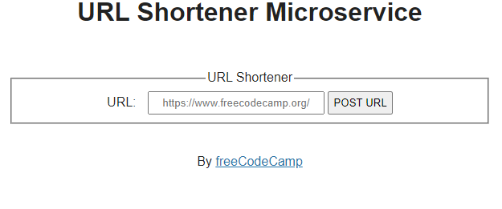

# URL Shortener Microservice

- This API allows shortening URLs.

- Since this is a backend pactice, the interface is just for testing and provided by FreeCodeCamp.

Technologies used: Javascript, NodeJS, MongoDB, Mongoose

# Live Version



# Running Locally

To run this locally, run the following commands in a terminal:

```
npm install
npm start
```

# Requirements

- You can POST a URL to /api/shorturl and get a JSON response with original_url and short_url properties. Here's an example: { original_url : 'https://freeCodeCamp.org', short_url : 1}
- When you visit /api/shorturl/<short_url>, you will be redirected to the original URL.
- If you pass an invalid URL that doesn't follow the valid http://www.example.com format, the JSON response will contain { error: 'invalid url' }